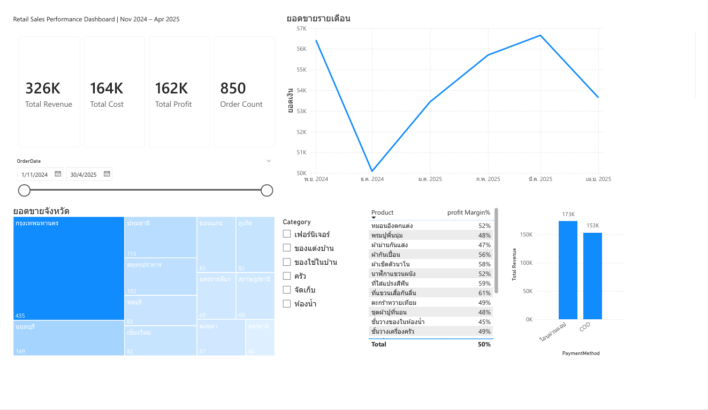

# Retail Sales Performance Dashboard

An end-to-end Power BI dashboard analyzing retail sales performance across products, regions, and payment channels.



## Overview

This dashboard tracks revenue, cost, profit, and order volume for an e-commerce retail store, allowing management to monitor performance trends and identify high-margin products and key regional markets.

**Period covered:** Nov 2024 – Apr 2025

## Key Metrics

| Metric | Value |
|---|---|
| Total Revenue | 326K |
| Total Cost | 164K |
| Total Profit | 162K |
| Order Count | 850 |
| Average Profit Margin | 50% |

## Features

- **KPI cards** — revenue, cost, profit, and order count at a glance
- **Monthly sales trend** — line chart revealing seasonal movement
- **Regional breakdown** — treemap of orders by province with gradient shading by volume
- **Payment channel analysis** — revenue split between bank transfer and COD
- **Product detail table** — profit margin % by SKU
- **Interactive filters** — category slicer and date range slider

## Tools & Techniques

- **Power Query** — data cleaning and transformation
- **DAX** — calculated measures for revenue, cost, profit, and margin
- **Conditional formatting** — gradient color scale on the treemap
- **Slicers** — category and date range filtering

### Sample DAX Measures

```dax
Total Revenue = SUMX(homu_sales_data, [Quantity] * [SalePrice])

Total Cost = SUMX(homu_sales_data, [Quantity] * [UnitCost])

Total Profit = [Total Revenue] - [Total Cost]

Profit Margin % = DIVIDE([Total Profit], [Total Revenue])
```

## Insights

- Bangkok dominates order volume, followed by Nonthaburi and Pathum Thani — the central region drives the majority of sales
- Bank transfer slightly outpaces COD in total revenue
- Sales dipped in Dec 2024 before recovering steadily through Mar 2025
- Profit margins range from 44% to 61% across products, with storage and bathroom items performing best

## Files

- `dashboard.png` — dashboard preview
- `retail_sales_dashboard.pbix` — Power BI source file

## Author

**Kittipong Kornngam** — Finance professional transitioning into data analytics  
[LinkedIn](https://www.linkedin.com/in/kittipong-kornngam-003b4b298) · kittipong.kornngam24@gmail.com
